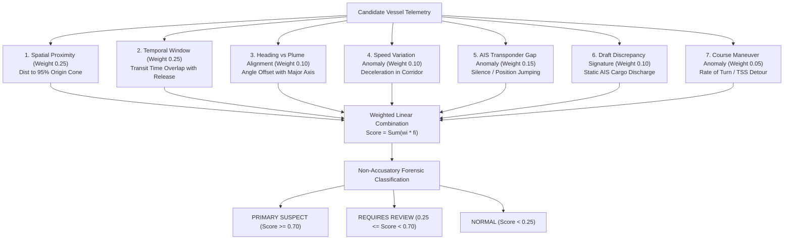

# TideTrace // AIS Ingestion & Vessel Attribution Engine
**Product Name:** TideTrace: Oil Spill Detection, Drift Analysis & Vessel Attribution Platform  
**Module:** `backend/services/dark_vessel_engine.py`, `backend/db/spatial_provider.py`  

---

## 1. PostGIS Spatial Database Queries
TideTrace uses PostGIS 3.4 for spatial indexing (R-Tree GiST indexes on geography points) to identify candidate vessels that transited through the 95% reverse drift origin cone during the calculated release time window $[T_{start}, T_{end}]$:

```sql
SELECT 
    v.vessel_id,
    v.name,
    v.mmsi,
    v.imo,
    v.vessel_type,
    ST_Distance(p.location, o.origin_centroid) AS closest_distance_m,
    MIN(ABS(EXTRACT(EPOCH FROM (p.timestamp - o.probable_spill_time)))) AS temporal_offset_seconds
FROM vessels v
JOIN ais_positions p ON v.vessel_id = p.vessel_id
CROSS JOIN reverse_drift_runs o
WHERE o.run_id = :drift_run_id
  AND p.timestamp BETWEEN o.window_start AND o.window_end
  AND ST_DWithin(p.location, o.origin_envelope_95, 5000) -- 5km buffer
GROUP BY v.vessel_id, v.name, v.mmsi, v.imo, v.vessel_type, p.location, o.origin_centroid
ORDER BY closest_distance_m ASC;
```

---

## 2. 7-Factor Multi-Criteria Decision Analysis (MCDA) Attribution Matrix
Each candidate vessel is evaluated across 7 forensic evidence factors with rigorous normalization:



---

## 3. Evidence Factor Formulations

1. **Spatial Proximity Score ($f_{spatial}$):**
   $$f_{spatial} = \exp\left(-\frac{d_{min}^2}{2 \sigma_{origin}^2}\right)$$
2. **Temporal Overlap Score ($f_{temporal}$):**
   $$f_{temporal} = \max\left(0, 1 - \frac{|t_{transit} - t_{origin}|}{\Delta t_{window}}\right)$$
3. **Heading Alignment Score ($f_{heading}$):**
   $$f_{heading} = \cos\left(\theta_{vessel\_cog} - \theta_{slick\_major\_axis}\right)$$
4. **AIS Gap Score ($f_{gap}$):**
   $$f_{gap} = \min\left(1.0, \frac{t_{silent\_minutes}}{120}\right)$$
5. **Draft Discharge Score ($f_{draft}$):**
   $$f_{draft} = \min\left(1.0, \frac{|\Delta \text{Draft}|}{2.0\text{ m}}\right)$$

Aggregate Attribution Confidence:
$$\text{Score}_{total} = \sum_{i=1}^7 w_i f_i, \quad \sum w_i = 1.0$$\n