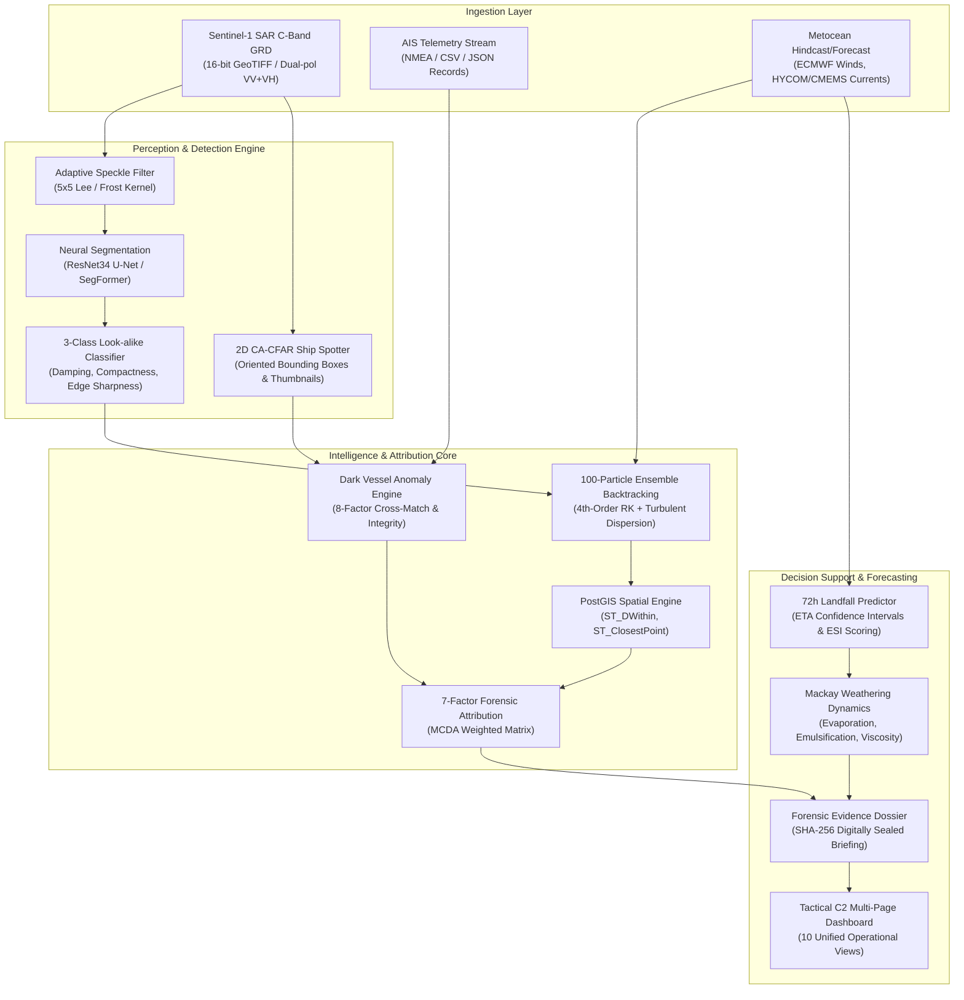
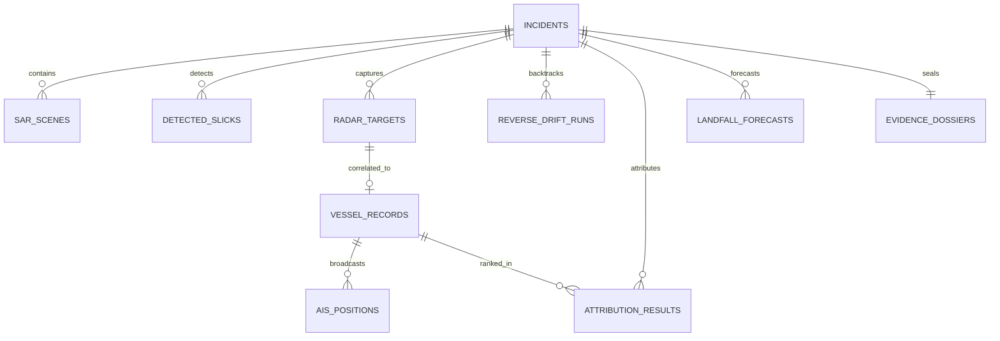

# TideTrace // System Architecture & Design
**Product Name:** TideTrace: Oil Spill Detection, Drift Analysis & Vessel Attribution Platform  
**Problem Statement:** NTRO PS 26143 (Smart India Hackathon 2026)  
**Classification:** Restricted // Decision-Support System  

---

## 1. Executive System Overview
TideTrace is a next-generation Domain Awareness (MDA) intelligence platform engineered to detect, classify, backtrack, and attribute marine oil spills using multi-modal satellite remote sensing (Synthetic Aperture Radar), Automatic Identification System (AIS) vessel telemetry, and Lagrangian metocean hydrodynamic transport modeling.

---

## 2. Core Functional Modules

### A. Satellite Remote Sensing & ML Engine (`ml_engine/`)
1. **Radiometric Calibration:** Converts raw SAR digital numbers to calibrated backscatter $\sigma^0$ in decibels (dB).
2. **Speckle Attenuation:** Vectorized 5×5 and 7×7 adaptive Lee and Frost filters preserve sharp oil-water boundary gradients while eliminating Rayleigh multiplicative speckle.
3. **Sliding-Window Inference with Hann Blending:** Tiles arbitrarily large SAR GeoTIFF scenes into 256×256 windows with 50% overlap, reconstructing probability maps using smooth 2D Hann window weighting to prevent tile-boundary seams.
4. **3-Class Look-Alike Rejection:** Implements empirical feature extraction (backscatter damping ratio, compactness, boundary edge gradient) to classify detected dark patches into `OIL`, `LOOK-ALIKE`, or `UNCERTAIN`.
5. **2D CA-CFAR Vessel Detector:** Cell-Averaging Constant False Alarm Rate algorithm with guard and training rings, extracting Oriented Bounding Boxes (OBB) and heading vectors for Marine targets.

### B. Oil Spill & Vessel Intelligence & Spatial Engine (`backend/services/`, `backend/db/`)
1. **Dark Vessel Intelligence Engine:** Cross-matches CFAR radar targets against live AIS broadcasts. Executes an 8-factor anomaly evaluation (transponder gaps, MMSI validity, SOG/Doppler deviation, COG/heading discrepancies, draft changes, TSS corridor compliance) to identify non-transponding and spoofed vessels.
2. **Lagrangian Reverse Drift Backtracking:** Simulates 100 Monte Carlo tracer particles backwards in time under wind leeway, Coriolis deflection, surface current drag, and Fickian turbulent diffusion. Generates 2D origin probability density grids and 50%, 80%, 95% confidence envelopes.
3. **Forensic MCDA Vessel Attribution:** Correlates historical vessel trajectories with the 95% origin probability cone using PostGIS spatial indexing (`ST_DWithin`). Applies a 7-factor weighted scoring matrix to output non-accusatory ranks (`PRIMARY SUSPECT`, `REQUIRES REVIEW`, `NORMAL`).
4. **Forward Landfall & Weathering Forecaster:** Projects forward oil trajectory up to +72 hours with ETA confidence intervals, Environmental Sensitivity Index (ESI) vulnerability mapping, and Mackay physico-chemical weathering kinetics (evaporation, emulsification, dynamic viscosity).
5. **SHA-256 Digital Sealing:** Deterministically hashes all evidence parameters, sensor metadata, and attribution matrices into an immutable cryptographic seal.

---

## 3. PostGIS Database Schema Architecture
Production PostgreSQL 16 + PostGIS 3.4 database schema definition (`backend/db/postgis_schema.sql`):

---

## 4. Security & Cryptographic Provenance
To ensure that attribution reports withstand legal scrutiny under MARPOL 73/78 Annex I proceedings, TideTrace applies a deterministic SHA-256 hash across:
- GeoTIFF acquisition time & sensor metadata
- SAR slick centroid & vectorized polygon coordinates
- Metocean wind & current forcing vectors
- Lagrangian 95% origin envelope geometry
- Primary suspect AIS & radar cross-match telemetry
- 7-factor attribution weighting parameters

Any post-hoc modification to the incident record immediately invalidates the digital seal.\n