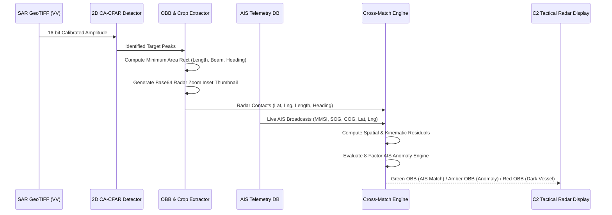

# TideTrace // 2D CA-CFAR & Dark Vessel Detection Engine
**Product Name:** TideTrace: Oil Spill Detection, Drift Analysis & Vessel Attribution Platform  
**Module:** `ml_engine/cfar_ship_detector.py`, `backend/services/dark_vessel_engine.py`  

---

## 1. 2D CA-CFAR Ship Detection Algorithm
In Marine radar surveillance, false alarms caused by ocean sea clutter must be strictly bounded. The **Cell-Averaging Constant False Alarm Rate (CA-CFAR)** dynamically calculates a localized detection threshold $T$ for every Cell Under Test (CUT):

```
+------------------------------------+
|  Training Cells (Clutter Average)  |
|   +----------------------------+   |
|   |   Guard Cells (No Leakage) |   |
|   |    +------------------+    |   |
|   |    | CUT (Target Pix) |    |   |
|   |    +------------------+    |   |
|   |                            |   |
|   +----------------------------+   |
+------------------------------------+
```

### Threshold Formulation:
$$T = \alpha_{CFAR} \cdot P_{clutter} = \alpha_{CFAR} \cdot \left(\frac{1}{N_{train}} \sum_{i=1}^{N_{train}} x_i\right)$$

$$\alpha_{CFAR} = N_{train} \left(P_{fa}^{-1/N_{train}} - 1\right)$$

where $P_{fa} = 10^{-4}$ is the target probability of false alarm, $N_{train} = 16\text{ cells}$, and $N_{guard} = 4\text{ cells}$.



---

## 2. Oriented Bounding Box (OBB) & Heading Extraction
Using OpenCV minimum bounding rectangle analysis on binary CFAR threshold blobs:
1. **Length & Beam Estimation:**
   $$\text{Length}_m = \text{major\_axis}_{px} \cdot \text{GSD}_{meters}, \quad \text{Beam}_m = \text{minor\_axis}_{px} \cdot \text{GSD}_{meters}$$
2. **Radar Heading Vector:**
   Extracted from the principal orientation angle $\phi$ of the OBB, disambiguated using historical ship wake features.
3. **High-Magnification Radar Thumbnail:**
   Extracts a $64\times 64$ sub-pixel cropped window centered on the radar echo, base64-encoded for tactical zoom-inset rendering on the frontend.

---

## 3. 8-Point AIS Anomaly Checklist
The `dark_vessel_engine` evaluates 8 diagnostic checks:
1. **Transponder Online Status:** Silence duration $> 30\text{ min}$ flags coverage gap.
2. **MMSI Format Validity:** Mid-digit country code and checksum inspection.
3. **SOG vs Doppler Deviation:** $> 3.0\text{ knots}$ kinematic discrepancy.
4. **COG vs Radar Orientation Offset:** $> 20^\circ$ angular discrepancy.
5. **Rate of Turn (ROT) Jitter:** High angular acceleration during quiet transit.
6. **Proximity to Spill Origin:** Distance to 95% backtrack envelope $< 5.0\text{ km}$.
7. **Draft Alteration:** Static message draft drop $> 1.0\text{ m}$ indicates possible slop discharge.
8. **TSS Lane Detour:** Unexplained deviation from standard shipping separation scheme.\n