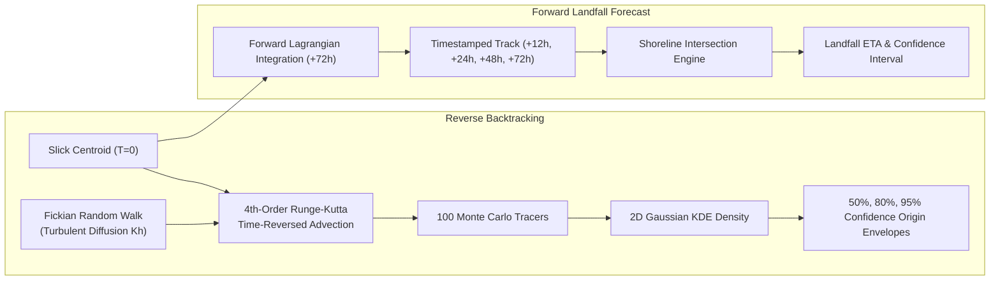

# TideTrace // Hydrodynamic Drift & Weathering Model
**Product Name:** TideTrace: Oil Spill Detection, Drift Analysis & Vessel Attribution Platform  
**Module:** `backend/services/drift_engine.py`, `backend/services/landfall_predictor.py`  

---

## 1. Lagrangian Particle Advection Physics
TideTrace uses a Lagrangian discrete parcel advection scheme integrated with 4th-Order Runge-Kutta (RK4) numerical stepping. The total velocity vector $\vec{u}_{slick}$ of an oil particle is given by:

$$\vec{u}_{slick} = \vec{u}_{current} + \alpha \mathbf{R}(\theta_{Coriolis}) \vec{u}_{wind} + \gamma \vec{u}_{Stokes}$$

Where:
- $\vec{u}_{current}$: 2D surface ocean current velocity (m/s)
- $\vec{u}_{wind}$: 10m surface wind velocity (m/s)
- $\alpha$: Wind leeway drag factor (typically $0.030 - 0.035$, i.e., $3.0 - 3.5\%$)
- $\theta_{Coriolis}$: Coriolis deflection angle ($10^\circ - 15^\circ$ to the right in the Northern Hemisphere)
- $\mathbf{R}(\theta)$: 2D rotation matrix:
  $$\mathbf{R}(\theta) = \begin{bmatrix} \cos\theta & -\sin\theta \\ \sin\theta & \cos\theta \end{bmatrix}$$
- $\gamma$: Wave-induced Stokes drift coefficient (typically $0.010 - 0.015$)

---

## 2. 100-Particle Monte Carlo Ensemble Backtracking
In reverse backtracking mode ($t \to -\Delta t$), deterministic transport is reversed. To account for sub-grid metocean turbulence and current measurement uncertainty, each of the 100 particles undergoes a random walk perturbation at each step $\Delta t$:

$$\delta x = \sqrt{2 K_h \Delta t} \cdot \mathcal{N}(0, 1), \quad \delta y = \sqrt{2 K_h \Delta t} \cdot \mathcal{N}(0, 1)$$

where $K_h = 2.5\text{ m}^2/\text{s}$ is the horizontal turbulent eddy diffusivity.

The final particle cluster at release time $T_{release}$ is fitted with a 2D Gaussian Kernel Density Estimator (KDE) to construct:
- **50% Core Probability Ellipse**
- **80% Secondary Probability Contour**
- **95% Legal Search & Attribution Origin Cone**

---

## 3. Physico-Chemical Petroleum Weathering Dynamics (Mackay Kinetics)
As oil drifts across the sea surface, its physical and chemical properties undergo degradation:

### 1. Evaporation Rate (Mackay Distillation Kinetics):
$$F_{evap} = \frac{T_{kelvin}}{K_{evap}} \ln\left(1 + \frac{K_{evap} K_{mass} A}{V_0} t\right)$$

### 2. Emulsification & Water Uptake ("Chocolate Mousse"):
$$\frac{d Y_w}{dt} = K_{emuls} (U_{wind} + 1)^2 \left(1 - \frac{Y_w}{Y_{max}}\right)$$
where $Y_w$ is the fractional water content (reaching up to $75-80\%$).

### 3. Dynamic Viscosity Escalation (Mooney Equation):
$$\mu(t) = \mu_0 \exp\left(C_{evap} F_{evap}\right) \exp\left(\frac{2.5 Y_w}{1 - 0.65 Y_w}\right)$$
Viscosity increases exponentially from $\sim 15\text{ cP}$ to $> 15,000\text{ cP}$, transforming liquid crude into dense, sticky tar mats.\n