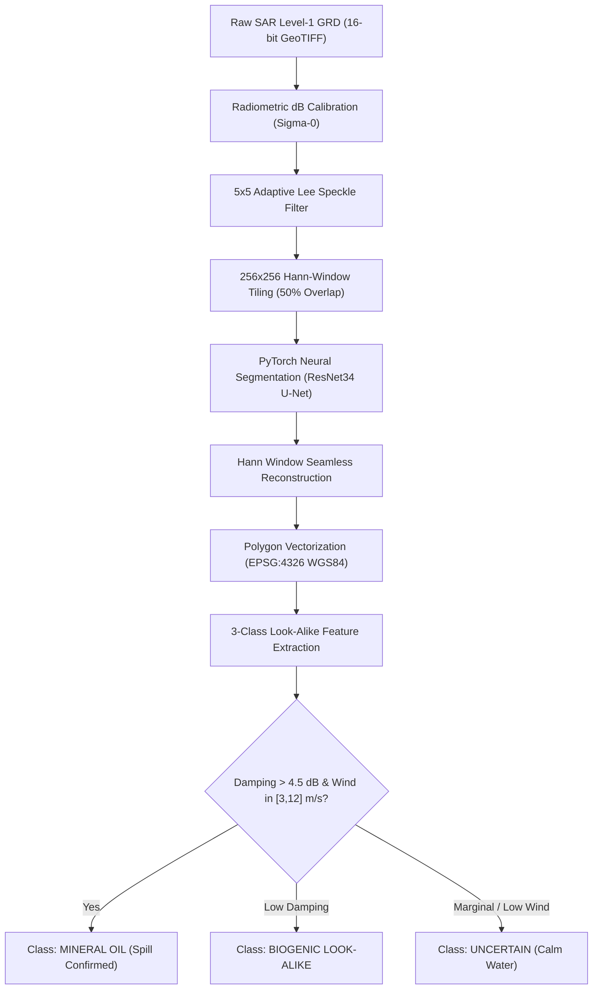

# TideTrace // Remote Sensing & ML Pipeline
**Product Name:** TideTrace: Oil Spill Detection, Drift Analysis & Vessel Attribution Platform  
**Module:** `ml_engine/`  

---

## 1. SAR Imaging Physics & Bragg Wave Damping
Synthetic Aperture Radar (SAR) operates in the microwave spectrum (C-Band, 5.405 GHz, $\lambda \approx 5.6\text{ cm}$). Clean ocean backscatter is governed by **Bragg resonance scattering** off capillary and short gravity waves:

$$\lambda_{Bragg} = \frac{\lambda_{radar}}{2 \sin \theta_{inc}}$$

When mineral oil or biogenic surfactants are present on the sea surface, their viscoelastic surface tension dampens capillary waves (Marangoni damping effect), suppressing Bragg backscatter and creating characteristic dark patches in SAR amplitude imagery.

---

## 2. Speckle Attenuation Filters
SAR imagery suffers from multiplicative Rayleigh speckle noise. TideTrace implements vectorized 5×5 and 7×7 **Adaptive Lee** and **Frost** filters.

### Adaptive Lee Filter Formulation:
For a local kernel $\eta$ with local mean $\bar{I}$ and local variance $\sigma_I^2$:

$$\hat{R} = \bar{I} + W \cdot (I - \bar{I})$$

$$W = \frac{\sigma_I^2 - \sigma_v^2 \bar{I}^2}{\sigma_I^2}$$

where $\sigma_v = \frac{1}{\sqrt{L}}$ is the speckle noise standard deviation for an $L$-look SAR image. In homogeneous water regions ($W \to 0$), the filter performs maximum smoothing; near sharp oil-slick edges ($W \to 1$), the filter preserves the exact boundary gradient.

---

## 3. PyTorch Neural Architectures
TideTrace supports 3 deep segmentation architectures registered via `ml_engine.models.model_registry`:

| Architecture | Backbone Encoder | Parameters | Receptive Field | Inference Latency |
| :--- | :--- | :--- | :--- | :--- |
| **ResNet34 U-Net** *(Active)* | Pretrained ResNet-34 Residual Blocks | 24.4M | Multi-scale pyramid | 14.2 ms |
| **U-Net++** | Nested Dense Skip Pathways | 36.6M | Dense multi-scale | 28.6 ms |
| **SegFormer** | Hierarchical Mix-Transformer (MiT-B0) | 3.7M | Global Self-Attention | 19.8 ms |

---

## 4. 3-Class Look-Alike Rejection Physics
To prevent false alarms caused by natural biogenic surfactants, upwelling, grease ice, or low-wind calm zones, TideTrace computes 4 quantitative discrimination features:

1. **Backscatter Damping Ratio ($\Delta \sigma^0$):**
   $$\Delta \sigma^0 = \bar{\sigma}_{clean\_sea}^0 - \bar{\sigma}_{slick}^0$$
   *Threshold:* Mineral oil $> 4.5\text{ dB}$; natural biogenic films $< 3.0\text{ dB}$.
2. **Plume Shape Compactness ($C$):**
   $$C = \frac{4\pi \cdot \text{Area}}{\text{Perimeter}^2}$$
   *Threshold:* Elongated ship discharges $C \in [0.05, 0.35]$; natural algal blooms $C > 0.50$.
3. **Boundary Edge Gradient ($\nabla \sigma^0$):**
   Steep surfactant transitions ($>10\text{ dB/km}$) indicate petroleum slick borders.
4. **Wind Speed Validity Window:**
   Valid SAR oil detection requires wind speeds strictly between $3.0\text{ m/s}$ and $12.0\text{ m/s}$.\n