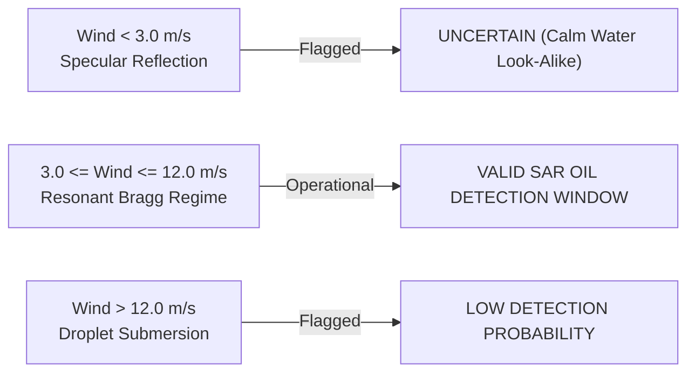

# TideTrace // Research Bounds & Operational Constraints
**Product Name:** TideTrace: Oil Spill Detection, Drift Analysis & Vessel Attribution Platform  
**Standard:** MARPOL 73/78 Annex I Forensic Compliance  

---

## 1. Remote Sensing Physics & Environmental Bounds

### A. Surface Wind Speed Operational Window
SAR oil spill detection relies strictly on capillary wave damping. The system operates within a verified operational window:
- **Low Wind Limit ($< 3.0\text{ m/s}$):** Mirror-like specular reflection causes entire sea surfaces to appear dark, triggering false look-alike alarms. TideTrace automatically flags scenes with $U_{10} < 3.0\text{ m/s}$ as `UNCERTAIN / CALM WATER`.
- **High Wind Limit ($> 12.0\text{ m/s}$):** Intense breaking waves submerge surface oil into small droplets within the water column, restoring surface roughness and masking the slick signature.

### B. Natural Biogenic Surfactant Look-Alikes
Biological slicks (fish oils, phytoplankton decay) damp high-frequency capillary ripples but leave short gravity waves intact. TideTrace extracts polarimetric damping ratios ($\Delta \sigma^0$) to ensure only petroleum slicks exceeding the $4.5\text{ dB}$ threshold are confirmed.

---

## 2. Hydrodynamic Drift Limitations
1. **Hindcast Current Grid Resolution:** Current datasets (HYCOM $1/12^\circ \approx 9\text{ km}$, CMEMS) cannot resolve near-shore tidal eddies $< 1\text{ km}$.
2. **Stokes Drift Estimation:** Wave-driven Stokes drift relies on parametric JONSWAP wave spectra when directional buoy data is unavailable.
3. **Ensemble Spread:** As backtrack duration increases beyond $18\text{ hours}$, the 95% confidence origin cone expands proportionally to $\sqrt{2 K_h t}$, requiring wider AIS search corridors.

---

## 3. Statutory Legal Disclaimer & MARPOL Protocol
TideTrace is an automated **Decision-Support System**. In accordance with Indian Coast Guard (ICG) and Directorate General of Shipping (DG Shipping) protocols:
- TideTrace provides probable cause evidence for vessel interception.
- Mandatory statutory enforcement requires on-scene physical verification, chemical fingerprinting via Gas Chromatography-Mass Spectrometry (GC-MS), and Oil Record Book (Part II) cargo log inspection.\n